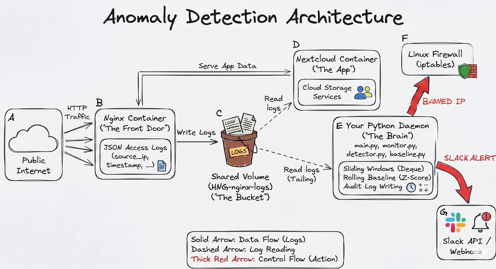

# Anomaly Detection Engine & Live Metrics Dashboard

A real-time DevSecOps tool designed to monitor Nginx traffic, learn behavioral baselines using Z-Score statistics, and automatically enforce security policies via `iptables`.

**Metrics Dashboard:** [http://34.35.146.90:8080](http://34.35.146.90:8080) (Terminated)

**Live Nextcloud Instance:** [http://34.35.146.90](http://34.35.146.90) (Terminated)

>Project Status: Decommissioned
>
>**Date:** May 11, 2026
>
>The live VPS instance and metrics dashboard have been terminated to optimize operational costs.
>
>**Evidence of Operation:** While the live links are no longer active, full documentation of the engine's performance, including anomaly detection logs, automated blocking events, and the metrics UI can be found in the [**screenshots/**](./screenshots/) folder 
---

## System Architecture



The system operates as a sidecar daemon to a Nextcloud Docker stack:
* **Log Ingestion:** Nginx writes JSON-formatted access logs to a shared Docker volume (`HNG-nginx-logs`).
* **Real-time Tailing:** The Python daemon tails the logs, parsing source IPs and request metadata.
* **Statistical Analysis:** Traffic is analyzed through a sliding window and compared against a rolling 24-hour baseline.
* **Automated Response:** Anomalies trigger `iptables` DROP rules and Slack notifications.

---

## Engineering Implementation

### 1. Sliding Window Logic
Instead of fixed-interval counters, this engine uses a **Time-Based Sliding Window** implemented via `collections.deque`. 
* **Eviction Logic:** Every incoming request triggers an eviction check. Timestamps older than 60 seconds are popped from the left of the deque.
* **Why?** This ensures a precise sub-second view of request density at any given moment, preventing "boundary misses" common in simple counters.

### 2. Statistical Baseline & Z-Score
The engine maintains 24 hourly slots to account for diurnal traffic patterns.
* **Rolling Baseline:** Every 60 seconds, the engine recalculates the **Mean** and **Standard Deviation** from the last 30 minutes of per-second traffic counts.
* **Z-Score Trigger:** An IP is flagged if its rate exceeds a **Z-Score of 3.0** or **5x the baseline mean**.
* **Error Surge:** If an IP's 4xx/5xx error rate exceeds 3x its baseline, the Z-score threshold is automatically tightened from 3.0 to 1.5 to mitigate scanning/brute-force attempts.

### 3. Blocking & Auto-Unban
* **Enforcement:** Uses `iptables` to block traffic at the kernel level for maximum performance.
* **Backoff Schedule:** 10m → 30m → 2h → Permanent.
* **Slack Integration:** Real-time alerts including Z-score, baseline mean, and current rate.

---

##  Setup & Installation

### Prerequisites
* Ubuntu 22.04+ VPS
* Docker & Docker Compose
* Python 3.10+

### Step 1: Deploy the Stack
```bash
git clone https://github.com/Wandile-lab/Anomaly-Detection-Engine.git

sudo docker compose up -d
```

### Step 2: Configure the Daemon
* Create a .env file in the detector/ directory:
* Add your webhook URL: SLACK_WEBHOOK_URL=https://hooks.slack.com/services/YOUR/KEYS/HERE

### Step 3: Run the Engine
```bash
cd detector
python3 -m venv venv
source venv/bin/activate
pip install -r requirements.txt

# Run the engine (requires sudo for iptables)
sudo ./venv/bin/python main.py &

# Run the dashboard
python dashboard.py 
```
### Verification Checklist
To ensure the entire stack is operational, run:
1. `sudo docker ps` - You should see the Nextcloud and Nginx containers as 'Up'.
2. `sudo iptables -L -n` - Verify the 'DOCKER-USER' or 'INPUT' chains are accessible.
3. `tail -f audit.log` - Watch for the first `RECALC` event (occurs after 60s).
---
## Audit Logging
* All critical actions are recorded in audit.log following the required structure:
```
[timestamp] ACTION ip | condition | rate | baseline | duration

```
### Example:
```
 [2026-04-29 14:32:10] BAN 192.168.1.10 | Z-Score 4.2 | 120 req/s | 25.00 | 600s

```

## Blog Post

Read the full technical deep-dive on how this was built here:

https://dev.to/wandile_ndlovu_7dd22d4943/how-i-built-an-adaptive-immune-system-for-cloud-traffic-53b

## Screenshots

All required proof of operation can be found in the /screenshots directory.
